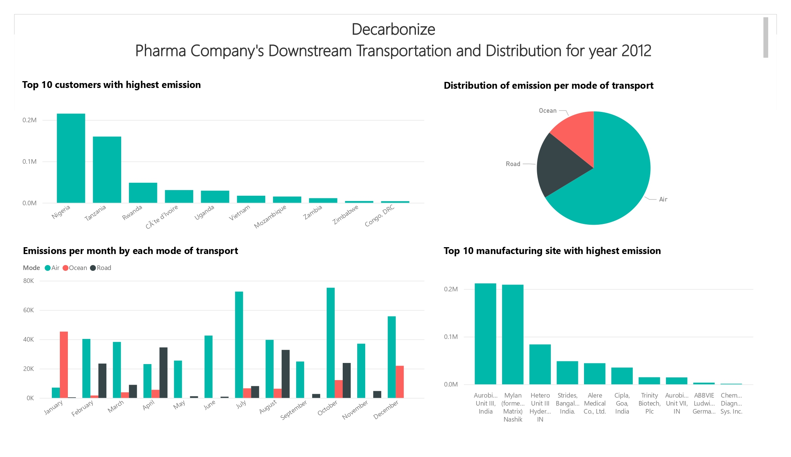

# Scope 3 Accounting for Transportation Data - Pharma Company

This repository contains code and data for a Scope 3 Accounting project for transportation data in a pharmaceutical company. Below is a brief overview of the contents of this repository.

## Table of Contents
1. [ Project Description ](#projectDescription)
2. [Installation](#installation)
3. [Data Collection](#dataCollection)
4. [Assumptions made regarding the data](#assumptions)
5. [Steps taken to create the project](#steps)
6. [Results](#results)
7. [Future work](#futureWork)

## Project Description
This project aims to implement Scope 3 Accounting for transportation data in a pharmaceutical company. The Scope 3 Accounting framework is used to identify and measure indirect emissions that occur in the supply chain, including emissions from the transportation of goods. The project will focus on collecting and analyzing transportation data from suppliers, distributors, and other partners in the supply chain to identify opportunities to reduce emissions and improve sustainability. The ultimate goal of the project is to reduce the environmental impact of the transportation activities of the pharmaceutical company by finding out the main distributers causing emissions for the company. 

## Installation
- Following packages were used to create the project
    1. Pandas 
    2. Numpy
    3. Geopy
    4. openrouteservice
    5. searoute
    6. country_converter

## Data Collection
1. SCMS_Delivery_History_Dataset_20150929.csv - Extracted from Data.world
2. airports.csv - Contains all the types of international airport in the wprld
3. country-capital-list.csv - Contains all the capitals of the countries.
4. attributed_ports.geojson - Contains all the international ports in the world.

## Assumptions made regarding the data
1. The Transportation and distribution services are purchased by the reporting company in the reporting year.
2. Category 9 of Scope 3 standards to be considered, i.e. (Downstream transportation and distribution)
3. Destination location has been specified in the 'country' column. Since the city name has not been mentioned, I will assume:
    1. The Air/Road transport to be in the Capital city, so calculating the nearest airport to the capital city. 
    2. Ocean transport to be the nearest port to the capital city.
4. Source location has been mentioned in the 'Manufacturing Site' column, need to extract the city name and coordinates.
    1. Global data of airports and ports is used to find the nearest transport location to the manufacturing site.
    2. In the airports data, many different types of airports are mentioned. I have considered all the airports for calculating the nearest airport.
5. Emission factors for each transport mode is a generalised value taken from GHG.

## Steps taken to create the project
<a href="./Steps.md"> LINK </a>

## Results
<a href="Output/pharma_scope3_category9_emissions.csv"> Results in CSV </a>

I will the post the Power BI tool link in the coming future.

## Future work
- [ ] Using better API/Algorithm to calculate Road and Sea distance
- [ ] Optimizing the code.
- [ ] Medium post to explain the results